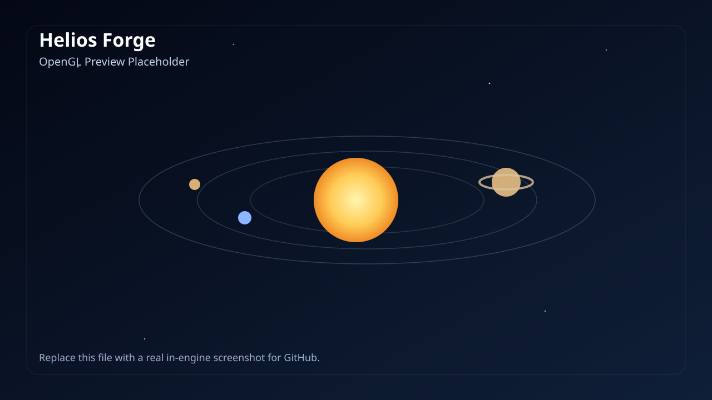
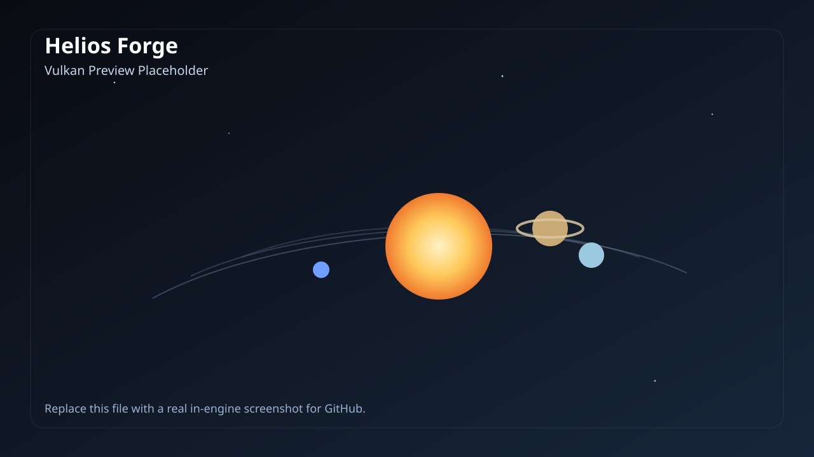

# Helios Forge

> AI-generated project: this repository was created with AI assistance and should be reviewed before production or educational reuse.
>
> AI 生成项目：本仓库由 AI 辅助生成，公开发布、继续开发或教学使用前建议人工审查。


Helios Forge is a real-time 3D solar system renderer built as a compact graphics playground for comparing multiple rendering paths in one repository.

Helios Forge 是一个实时 3D 太阳系渲染项目，定位为一个小型图形学实验场，用同一套场景对比多个渲染实现。

## Screenshots

| OpenGL | Vulkan |
| --- | --- |
|  |  |

You can replace these placeholder previews with real captures after running the project locally.

你可以在本地运行程序后，用真实截图替换这些占位图。

## Project Name

- Display name: `Helios Forge`
- Recommended GitHub repository name: `helios-forge`

Why this name:

- `Helios` matches the solar-system theme directly
- `Forge` fits the low-level rendering / systems-programming tone
- short, searchable, and suitable for GitHub branding

命名原因：

- `Helios` 直接对应太阳系主题
- `Forge` 更贴近底层图形与工程实现气质
- 简短、容易搜索，适合作为 GitHub 仓库名

## English

### Overview

This repository currently contains four implementations of the same solar-system scene:

- `solar_system_modern`: C + OpenGL
- `solar_system_vulkan`: C + Vulkan
- `solar_system_metal`: Objective-C + Metal (macOS)
- `solar_system_modern.py`: Python + Pygame + PyOpenGL reference implementation
- `web/`: TypeScript + Vite + Three.js browser implementation

The scene includes:

- the Sun and eight planets
- textured planets
- orbital paths
- star background
- Saturn ring rendering
- free camera and target lock controls
- speed control and pause support

### Why This Exists

This project is useful for learning and experimentation around:

- real-time rendering fundamentals
- procedural sphere, ring, orbit, and star geometry
- shader-based planet rendering
- camera interaction design
- comparing OpenGL and Vulkan structure in a small codebase

### Repository Layout

```text
.
├── Makefile
├── README.md
├── LICENSE
├── solar_system_modern.c
├── solar_system_vulkan.c
├── solar_system_metal.m
├── solar_system_modern.py
├── shaders/
├── assets/textures/
└── docs/screenshots/
```

### Tech Stack

- C11
- OpenGL 3.3 Core + GLEW + GLFW
- Vulkan + GLFW
- Metal + Cocoa + CAMetalLayer
- GLSL
- Python 3
- Pygame
- PyOpenGL
- NumPy
- `stb_image` / `stb_image_write`
- TypeScript
- Vite
- Three.js

### Requirements

For native builds:

- `cc`
- `make`
- `pkg-config`
- `glfw3`
- `glew`
- OpenGL development libraries
- Vulkan development libraries / SDK
- `glslc` for SPIR-V shader compilation

For the Python build:

- Python 3
- `pygame`
- `PyOpenGL`
- `numpy`

Install Python dependencies:

```bash
python3 -m pip install -r requirements.txt
```

Install Web dependencies:

```bash
cd web
npm install
```

### macOS Vulkan Notes

macOS does not natively support Vulkan. It requires [MoltenVK](https://github.com/KhronosGroup/MoltenVK) (a Vulkan-to-Metal translation layer).

1. Install dependencies:

   ```bash
   brew install molten-vk vulkan-loader shaderc vulkan-tools
   ```

2. The Homebrew GLFW bottle is **not** compiled with Vulkan support. Rebuild GLFW from source:

   ```bash
   git clone --depth 1 --branch 3.4 https://github.com/glfw/glfw.git /tmp/glfw-build
   cmake -S /tmp/glfw-build -B /tmp/glfw-build/build \
     -DCMAKE_PREFIX_PATH=$(brew --prefix) \
     -DBUILD_SHARED_LIBS=ON \
     -DGLFW_BUILD_DOCS=OFF -DGLFW_BUILD_TESTS=OFF -DGLFW_BUILD_EXAMPLES=OFF
   cmake --build /tmp/glfw-build/build
   cp /tmp/glfw-build/build/src/libglfw.3.4.dylib $(brew --prefix)/opt/glfw/lib/libglfw.3.4.dylib
   ```

3. Set the environment variable before running:

   ```bash
   export VK_ICD_FILENAMES=$(brew --prefix)/etc/vulkan/icd.d/MoltenVK_icd.json
   ```

   Add it to your shell profile (`~/.zshrc`) to persist across sessions.

Note: running `brew upgrade glfw` will replace the Vulkan-enabled build. Re-run step 2 afterwards.

### Build

Build everything:

```bash
make
```

Build OpenGL only:

```bash
make solar_system_modern
```

Build Vulkan only:

```bash
make solar_system_vulkan
```

Build Metal only on macOS:

```bash
make solar_system_metal
```

Clean binaries and compiled Vulkan shaders:

```bash
make clean
```

### Run

OpenGL version:

```bash
./solar_system_modern
```

Vulkan version:

```bash
./solar_system_vulkan
```

Metal version on macOS:

```bash
./solar_system_metal
```

Python version:

```bash
python3 solar_system_modern.py
```

Web version:

```bash
cd web
npm run dev
```

### OpenGL Frame Capture

The C/OpenGL build supports frame capture:

```bash
./solar_system_modern --frame-output frame.png --max-frames 300
```

This writes the final rendered frame to a PNG file.

### Controls

- `Mouse drag`: rotate camera
- `Mouse wheel`: zoom
- `W`, `A`, `S`, `D`: move camera
- `L`: toggle target lock
- `0`: focus Sun
- `1` to `8`: focus planets
- `+` / `-`: adjust simulation speed
- `Space`: pause / resume
- `Esc`: quit

Web version controls:

- `Mouse drag`: rotate camera
- `Mouse wheel`: zoom
- `W`, `A`, `S`, `D`: move camera
- `L`: toggle target lock
- `0`: focus Sun
- `1` to `8`: focus planets
- `+` / `-`: adjust simulation speed
- `Space`: pause / resume

### AI Disclosure

This repository is intentionally labeled as AI-generated. That means:

- the code and documentation were produced with AI assistance
- implementation details may need human review
- naming, structure, and wording were optimized for GitHub presentation, not formal scientific accuracy

### License

This project is released under the MIT License. See [LICENSE](LICENSE).

## 中文

### 项目简介

这个仓库目前包含同一套太阳系场景的三个实现版本：

- `solar_system_modern`：C + OpenGL
- `solar_system_vulkan`：C + Vulkan
- `solar_system_modern.py`：Python + Pygame + PyOpenGL 参考实现

当前场景包含：

- 太阳与八大行星
- 行星纹理贴图
- 轨道线
- 星空背景
- 土星光环
- 自由相机与目标锁定
- 时间速度调节与暂停

### 这个仓库适合做什么

它比较适合用于：

- 学习实时渲染基础
- 理解球体、光环、轨道线、星空点的程序化几何生成
- 理解基于着色器的行星渲染流程
- 练习相机交互逻辑
- 对比 OpenGL 与 Vulkan 在小型项目中的组织方式

### 目录结构

```text
.
├── Makefile
├── README.md
├── LICENSE
├── solar_system_modern.c
├── solar_system_vulkan.c
├── solar_system_modern.py
├── shaders/
├── assets/textures/
└── docs/screenshots/
```

### 技术栈

- C11
- OpenGL 3.3 Core + GLEW + GLFW
- Vulkan + GLFW
- GLSL
- Python 3
- Pygame
- PyOpenGL
- NumPy
- `stb_image` / `stb_image_write`

### 环境要求

原生 C 版本需要：

- `cc`
- `make`
- `pkg-config`
- `glfw3`
- `glew`
- OpenGL 开发库
- Vulkan SDK 或系统 Vulkan 开发包
- `glslc` 用于编译 Vulkan 着色器

Python 版本需要：

- Python 3
- `pygame`
- `PyOpenGL`
- `numpy`

安装 Python 依赖：

```bash
python3 -m pip install -r requirements.txt
```

### macOS Vulkan 注意事项

macOS 不原生支持 Vulkan，需要通过 [MoltenVK](https://github.com/KhronosGroup/MoltenVK)（Vulkan 到 Metal 的翻译层）运行。

1. 安装依赖：

   ```bash
   brew install molten-vk vulkan-loader shaderc vulkan-tools
   ```

2. Homebrew 的 GLFW bottle **未编译 Vulkan 支持**，需要从源码重建：

   ```bash
   git clone --depth 1 --branch 3.4 https://github.com/glfw/glfw.git /tmp/glfw-build
   cmake -S /tmp/glfw-build -B /tmp/glfw-build/build \
     -DCMAKE_PREFIX_PATH=$(brew --prefix) \
     -DBUILD_SHARED_LIBS=ON \
     -DGLFW_BUILD_DOCS=OFF -DGLFW_BUILD_TESTS=OFF -DGLFW_BUILD_EXAMPLES=OFF
   cmake --build /tmp/glfw-build/build
   cp /tmp/glfw-build/build/src/libglfw.3.4.dylib $(brew --prefix)/opt/glfw/lib/libglfw.3.4.dylib
   ```

3. 运行前设置环境变量：

   ```bash
   export VK_ICD_FILENAMES=$(brew --prefix)/etc/vulkan/icd.d/MoltenVK_icd.json
   ```

   可写入 `~/.zshrc` 使其持久化。

注意：`brew upgrade glfw` 会覆盖 Vulkan 版本，升级后需重新执行第 2 步。

### 构建

构建全部目标：

```bash
make
```

只构建 OpenGL 版本：

```bash
make solar_system_modern
```

只构建 Vulkan 版本：

```bash
make solar_system_vulkan
```

清理可执行文件和 Vulkan 编译产物：

```bash
make clean
```

### 运行

运行 OpenGL 版本：

```bash
./solar_system_modern
```

运行 Vulkan 版本：

```bash
./solar_system_vulkan
```

运行 Python 版本：

```bash
python3 solar_system_modern.py
```

### OpenGL 截帧

C/OpenGL 版本支持输出最终帧：

```bash
./solar_system_modern --frame-output frame.png --max-frames 300
```

该命令会在渲染指定帧数后，将最终画面写入 PNG。

### 操作说明

- `鼠标左键拖拽`：旋转视角
- `鼠标滚轮`：缩放
- `W/A/S/D`：移动相机
- `L`：切换目标锁定
- `0`：选择太阳
- `1` 到 `8`：选择行星
- `+` / `-`：调整模拟速度
- `Space`：暂停 / 继续
- `Esc`：退出

### AI 生成说明

本仓库明确标注为 AI 生成项目，含义如下：

- 代码与文档由 AI 辅助生成
- 实现细节仍然需要人工审查
- 命名、结构和文案优先服务于 GitHub 展示，不代表严格的科学建模

### 许可证

本项目采用 MIT License，详见 [LICENSE](LICENSE)。
